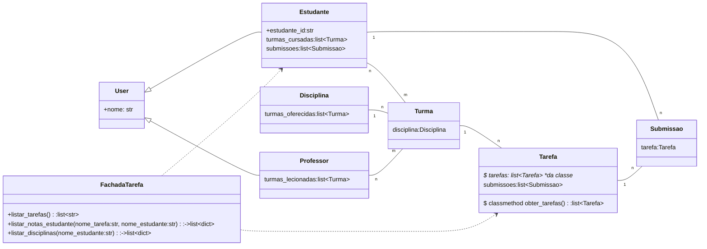

# Ag22_SimP1

# Simulado da P1

## Atenção: Realize todas as mudanças e consertos que eventualmente se tornarem necessário


O diagrama de classes mostra como funciona um sistema de LMS (Learning Management System) chamado QuadroNegro 

As classes de negócio estão no `model/quadronegro.py`

O web service Flask deve ficar em `app.py`. Neste arquivo você precisa implementar algumas rotas.

Os testes devem ficar na pasta `teste`

# Classes

Um estudante está matriculado em uma ou mais turmas. Ex.: "Diana está na Turma de DevLife de 2022/1"

Cada turma tem vários estudantes.

Uma turma está relacionada a uma disciplina. Por exemplo a turm a "Devlife 2022/1" está relacionada à disciplina "DevLife". 

As turmas têm status `EM_ABERTO` durante o ano corrente, mas depois precisam virar para status `CONCLUIDO`. 

Cada turma vai ter diversas instâncias da classe `Tarefa`, cada tarefa pertence só a uma turma.

Os objetos da classe `Tarefa` têm o método `submeter` que permitem que o aluno envie uma submissão para aquela tarefa e já auto-corrige. A correção neste exemplo só compara duas strings e a nota é quanto elas são similares. 

A classe `FachadaTarefa`  deve usar as demais classes do quadronegro para implementar o que está pedido nas docstrings do método (as strings soltas). Esta classe depois vai ser chamada em app.py. 

Tanto `Estudante` quando `Professor` são classes filhas da classe `User`. Você não vai precisar mexer em *User* nem em *Professor*.

A classe `Tarefa` vai ter um método `listar_submissoes_aluno` que lista todas as submissões daquela tarefa feitas por um dado aluno. Este método precisa ser implementado. 

## código 

O código a seguir exemplifica como os objetos interagem: 

```python 

if __name__ == "__main__":
    d = Disciplina("DevLife")
    tur = Turma(d, "DevLife 2022/1")
    estudante = Estudante("Diana Deana")
    estudante.matricular(tur)
    tarefa = Tarefa(tur, "Pedro Álvares Cabral")
    tur.tarefas.append(tarefa)
    tarefa.submeter("Pedro A", estudante, datetime.datetime(2022, 09, 16))
    

```


# Diagrama de classes 

Diagrama de classes da aplicação




# Questões

## Questao 1 

Implemente a função `Tarefa.listar_submissoes_aluno()`  que lista todas as submissões de um determinado aluno.

Crie alguns objetos para demonstrar o funcionamento ou use o `main` de `quadronegro.py`  para testar 


## Questao 2 

Crie os testes a seguir. Cabe a você no setup do teste criar objetos para verificar se tudo funciona:  

### 2.1 

Checar se as submissões têm texto no atributo  `resposta` 

### 2.2 
Checar se as submissões do estudante são de tarefas pertencentes a turmas que o estudante cursa 

### 2.3 
Checar se o estudante só pertence a determinada turma uma única vez

### 2.4
Checar se todas as turmas que o estudante tem em aberto são do ano atual


## Questão 3 

Crie um endpoint/um web service rest/etc que encapsule as funções da classe `FachadaTarefa`

Rode o Flask para testar  seu web service. 
Usando o postman, teste seu web service e salve a collection como JSON na pasta testes 


### Questão 4

Faça um diagrama de sequência do que acontece quando o método *listar_notas_estudante()* de FachadaTarefa é chamado (num papel e anexe uma foto ou faça no site draw.io)


### Questão 5
**a**. Na linha 57 da classe tarefa existe o seguinte comentário:
```python
        aluno.submissoes.append(submissao) # TODO: isso é um bom encapsulamento? Por quê? 
```
Analise a classe e procure responder à pergunta. Pode pesquisar


**b** A classe FachadaTarefa e seu método listar_notas_estudante() são RESTful? Por que não são?  (no simulado pode consultar a aula da semana 5). Como seria o acesso às notas do estudante para uma tarefa de maneira mais RESTful. Dê exemplos de como ficariam os endpoints. 


