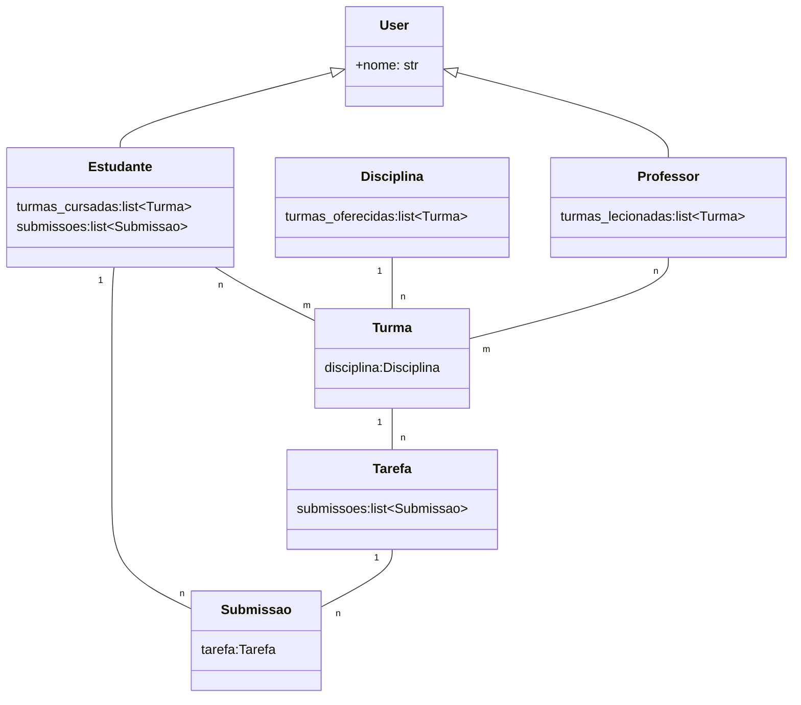

# Diagrama de classes 

Diagrama de classes da aplicação

Explicação

```mermaid
classDiagram
class User {
+nome: str
}
class Professor {
turmas_lecionadas:list~Turma~ 
}
class Estudante {
turmas_cursadas:list~Turma~ 
submissoes:list~Submissao~ 
}
class Disciplina {
turmas_oferecidas:list~Turma~
}
class Turma {
disciplina:Disciplina
}
class Tarefa {
submissoes:list~Submissao~
}
class Submissao {
tarefa:Tarefa
}
Estudante "n" -- "m" Turma 
Estudante "1" -- "n" Submissao 
Tarefa "1" -- "n" Submissao
Turma "1" -- "n" Tarefa
Disciplina "1" -- "n" Turma 
Professor "n" -- "m" Turma
User <|-- Estudante
User <|-- Professor
```

